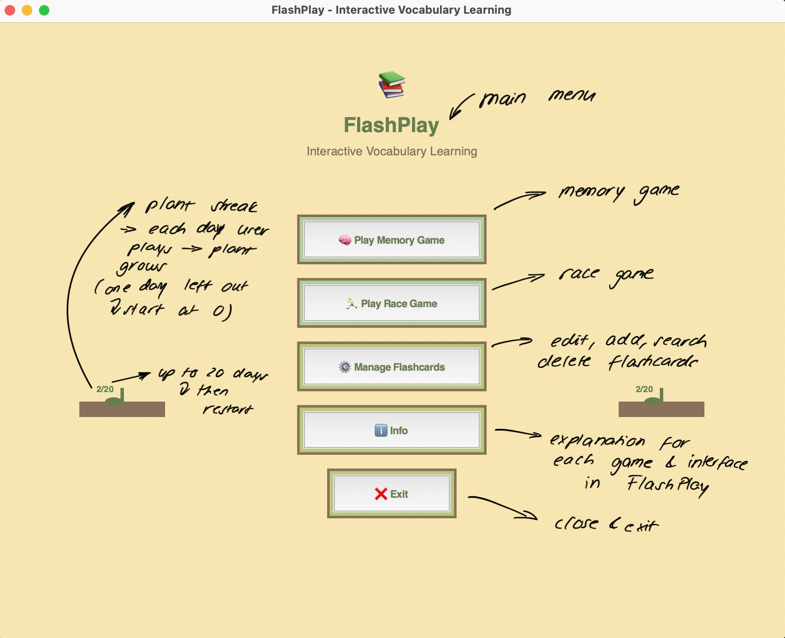
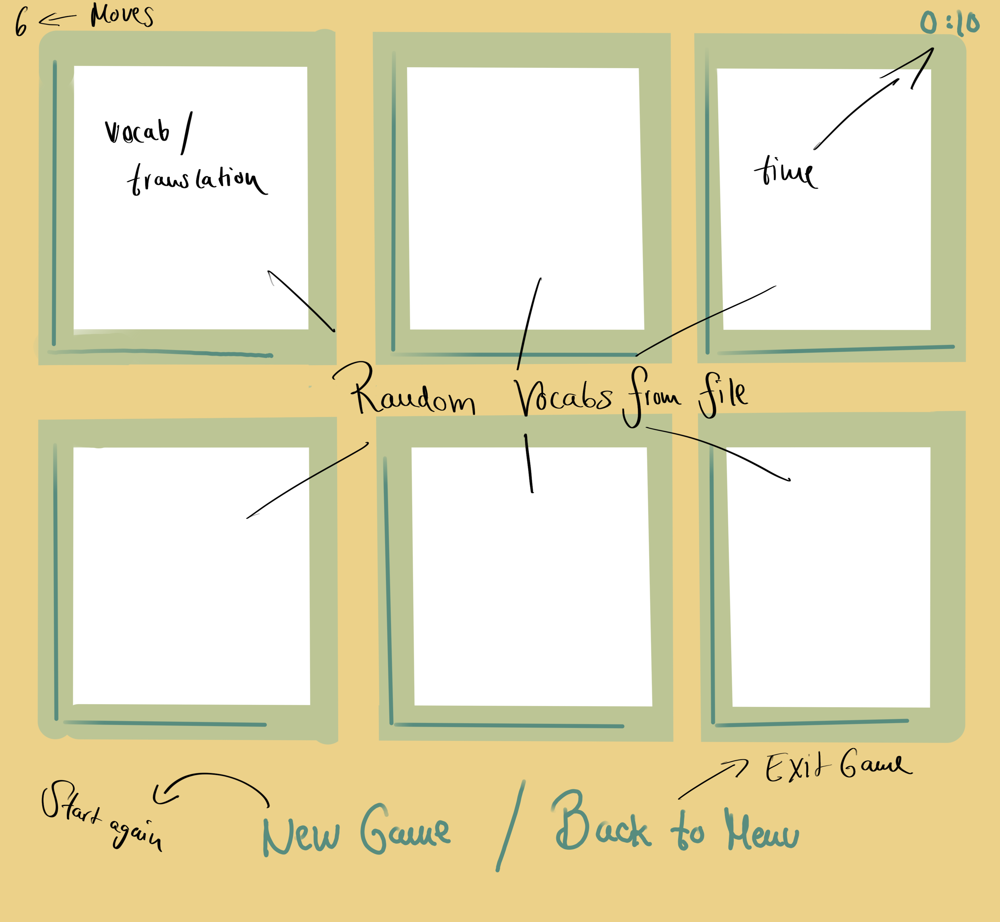
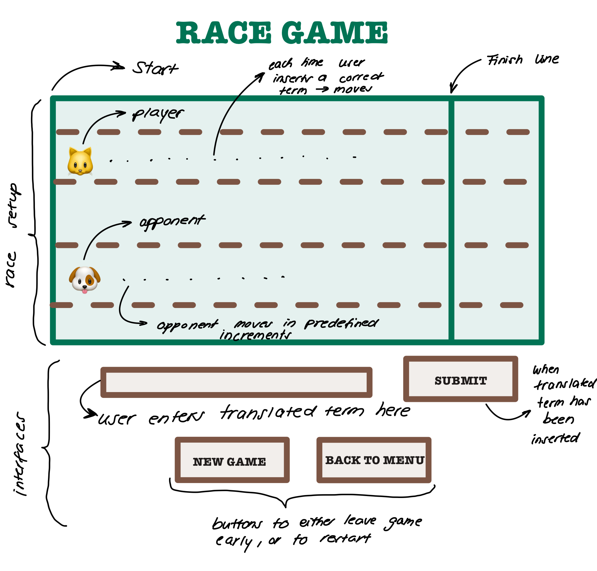

## Documentation 

## Project Overview
FlashPlay is an interactive vocabulary learning application.
It combines flashcard management, mini-games (Memory and Race), and a streak-based plant growth system to make learning engaging and consistent.
The program is built with Python, using:
- Tkinter for the user interface,
- SQLite for flashcard storage,
- deep-translator (GoogleTranslator) for automated translations.
Target users are students and language learners who want a fun and gamified way to build their vocabulary.

## Sketches

## main.py and flaschcards.py
## developement process and challenges 
- We first created an overall structure (main.py + flashcards.py) so each team member could work on games individually.
- A shared color scheme was chosen to make both games and UI consistent.
- We encountered a Git issue where Paula couldn’t see Frieda’s commits.
  We asked ChatGPT for troubleshooting steps to fix this. - Yet sadly, that didn't help us, so we decided to create a new repository. Then it worked! 
- To ensure that the file connections worked, we asked ChatGPT to generate a basic Memory Game & Race Game as a test before implementing our own versions.

    ## main.py
    - Acts as the main application entry point.
    - Builds and manages the Tkinter user interface.
    - Provides the main menu and navigation between different features:
      - Play Memory Game
      - Play Race Game
      - Manage Flashcards (add, edit, delete, search)
      - Info/Help window
      - Implements streak tracking with the PlantTracker system.
      - Ensures a consistent color scheme and styling across all screens.
      - Handles translations when adding new flashcards.
    ## flashcards.py
    - Provides the FlashcardManager class, which handles all database operations.
    - Uses SQLite to store flashcards (term and translation).
    - Supports operations:
      - Create new flashcards
      - Retrieve all flashcards
      - Update existing flashcards
      - Delete flashcards
      - Automatically creates the database (db/flashcards.db) and table if they do not exist.
 
## Memory Game - Paula
### Tkinter Fundamentals

**What I learned:** Tkinter is Python's standard GUI (Graphical User Interface) toolkit that comes built-in with Python. 
It provides widgets (buttons, labels, frames, etc.) to create desktop applications. 
It functions similarly to Pygame but focuses more on traditional desktop interfaces rather than game graphics.

**Key concepts implemented:** Firstly, I started with the main window structure. 
Here, I implemented the parent-child relationships as learned in class - each widget needs a parent container. 
For the basic layout, similar to what I knew from HTML, I used the layout managers tkinter provides: pack(), grid(), and place(). 
The event handling was done with bind() methods to capture mouse clicks and hover events. 
To understand how these worked together, I looked at the original Tkinter Documentation and found most of the basic concepts explained there.

**Sources that helped:** 

- Python.org Tkinter Tutorial https://docs.python.org/3/library/tkinter.html
- Real Python Tkinter Guide https://realpython.com/python-gui-tkinter/
- in general used as a source https://tkdocs.com/shipman/tkinter.pdf
### Creating Rounded Corners with Canvas

**What I learned:**
Tkinter widgets are rectangular by default, so creating rounded corners required learning about the Canvas widget and polygon drawing. 
This was completely new to me since I had only worked with basic rectangular widgets before.

**Key concepts implemented:**
The biggest challenge was understanding how to calculate the points for a rounded rectangle mathematically. 
I had to figure out that you need to define specific coordinates that create smooth curves. 
I started by looking up how rounded rectangles work geometrically, then implemented the _round_points() function that calculates all the corner positions.
The Canvas widgets create_polygon() method with smooth=True was the key to making the corners actually look rounded.
I also learned about layering - drawing the shadow first, then outer rim, then inner rim, so they stack properly.

**Sources that helped:**

- Tkinter Canvas Documentation (https://docs.python.org/3/library/tkinter.html#tkinter.Canvas)
- Stack Overflow: Rounded Rectangle in Tkinter (https://stackoverflow.com/questions/44099594/how-to-make-a-tkinter-canvas-rectangle-with-rounded-corners=, https://anzeljg.github.io/rin2/book2/2405/docs/tkinter/create_polygon.html?utm_source=chatgpt.com)
- A geometry tutorial I found online that explained how to calculate rounded rectangle points (https://stackoverflow.com/questions/76318063/rounded-rectangle-in-tkinter-that-i-can-fill-inside-and-change-the-color-from-un)

### Hover Effects and Dynamic Styling

**What I learned:** Making cards respond to mouse hover required understanding tkinter's event system. 
This was more complex than I initially thought because I had to manage different visual states.

**Key concepts implemented:** I discovered that tkinter uses specific event names like "<Enter>" and "<Leave>" for mouse hover detection. 
The tricky part was creating the closure functions (mk_hover) to capture the right widget references - 
I learned about Python closures here. 
I had to use configure() to change widget properties dynamically, 
and I learned to check the current game state before applying hover effects (like not showing hover during animations). 
The conditional styling was important - different colors for different card states.

**Sources that helped:**

- Tkinter Event Handling tutorial  (https://python-course.eu/tkinter/events-and-binds-in-tkinter.php)
Tkinter Hover Effects - (https://www.geeksforgeeks.org/python/tkinter-button-that-changes-its-properties-on-hover/, https://coderslegacy.com/python/tkinter-config/)

### Multi-Layer Card Design with Rims

**What I learned:**
Creating visually appealing cards required understanding how to layer multiple shapes on a Canvas to create depth effects. 
This was like creating a layered design in image editing software, but with code.

**Key concepts implemented:**
I learned that drawing order matters - background elements must be drawn first. 
I implemented a system where I draw the shadow (offset by a few pixels), then outer rim, then inner rim, then the main card background. 
Each layer uses slightly different sizes and positions to create the visual depth. 
I had to track the canvas IDs for each layer, so I could modify colors later. 
The hardest part was getting the mathematical offsets right so all the layers aligned properly.

**Sources that helped:**

- Canvas Layering Tutorial - (https://tkdocs.com/tutorial/canvas.html, https://stackoverflow.com/questions/43400856/change-the-color-of-an-object-after-tkinter-has-been-initiated/43400938#43400938)

### Card Flip Animation

**What I learned:**
Creating smooth animations without external libraries was challenging. 
I had to understand frame-based animation and timing in tkinter.

**Key concepts implemented:**
I implemented a two-phase animation: shrink the card width to zero, change the content, then expand back to full width. 
This creates the illusion of the card flipping. 
I used tkinter's after() method for timing - scheduling the next animation frame. 
The key insight was that I needed to prevent user interaction during animation with the flip_animation_running flag.
I also learned about mathematical interpolation - calculating intermediate values between start and end positions.

**Sources that helped:**

- Tkinter after() Method documentation - https://www.pythontutorial.net/tkinter/tkinter-after/, https://inf-schule.de/software/gui/entwicklung_tkinter/timer
- Game development tutorials that explained frame-based animation concepts https://tkinter.com/widget-animation-tkinter-customtkinter-23/

### Dynamic Color Changes Based on Card State

**What I learned:**
Cards needed different visual states (normal, hover, flipped, matched), which required a systematic approach to color management. 
This taught me about state machines in GUI programming.

**Key concepts implemented:**
I created a set_card_colors() method that can change all the rim colors at once. 
The challenge was managing all the different states - face-down cards use one color scheme, flipped term cards use another, flipped translation cards use a third, and matched cards use yet another. 
I had to use Canvas itemconfig() to modify the colors of already-drawn polygons. 
For the logic to work I needed to check the current state before applying color changes.

**Sources that helped:**

- here I used similar sources as I  number 3, because this bit relies on the same hover recognition

### Layout Management and Responsive Design

**What I learned:**
Making the game work at different window sizes required understanding tkinter's layout system. 
I learned about grid weights and dynamic sizing.

**Key concepts implemented:**
I implemented a grid system that automatically calculates the best arrangement of cards (trying to keep it roughly square). 
The _best_grid() function finds the optimal rows and columns for any number of cards. 
I learned about grid weights - making rows and columns expand proportionally when the window resizes. 
The responsive card sizing was tricky - I had to calculate available space and size cards proportionally while maintaining their aspect ratio.

**Sources that helped:**

- Tkinter Grid Manager documentation https://tkdocs.com/tutorial/grid.html
- winfo to measure available space https://www.tcl-lang.org/man/tcl8.4/TkCmd/winfo.htm
- Mathematical optimization tutorials for the grid calculation algorithm https://tkdocs.com/tutorial/concepts.html, https://docs.python.org/3/library/math.html

### Memory Management and Cleanup

**What I learned:**
Preventing memory leaks and crashes required proper cleanup of timers and event bindings. 
This was important for a smooth user experience.

**Key concepts implemented:**
I learned to track all after() timer IDs in a set, so I could cancel them when the game exits. 
Event bindings also needed to be unbound to prevent orphaned references. 
The _cleanup() method handles all of this systematically. 
I also learned about the importance of checking if widgets still exist before trying to update them - the update_timer() method includes this check.

**Sources that helped:**

- destroying widgets during cleanup https://tkdocs.com/tutorial/windows.html
- event bindings https://tkdocs.com/shipman/tkinter.pdf

## Race Game - Frieda 
#### ASCII art 
**What I learned**
Some functions print output directly into the console instead of returning it. 
To use that output in my program, I had to basically capture it.
Furthermore, character-specific offsets are necessary because different ASCII characters have different heights and widths.

**Key concepts implemented**
Instead of images, I used predefined ASCII characters from cowsay. 
Because sys.stdout normally sends output to the console I had to redirect it to a buffer (io.StringIO()), so that I could catch the printed ASCII art. 
After capturing, I restored stdout so normal printing worked again. 
This allowed me to clean the ASCII art (remove the unwanted speach bubble) and safely use it in the game's UI. 
The get_ascii_art(character, placeholder) function captures ASCII art and returns only the relevant lines.
Furthermore, the Exception handling and placeholders ensure that invalid inputs don't break the game. 

**Sources that helped:**
- sys.stdout https://docs.python.org/3.12/library/sys.html#sys.stdout
- cowsay https://pypi.org/project/cowsay/
- to get a first idea of "How to redirect print statements to Tkinter text widget" & use of sys.stdout https://stackoverflow.com/questions/12351786/how-to-redirect-print-statements-to-tkinter-text-widget
  - https://stackoverflow.com/questions/1218933/can-i-redirect-the-stdout-into-some-sort-of-string-buffer
- 

#### Tkinter Basics 
**What I learned**
I had never worked with tkinter before, so I first needed to learn how to build an interactive game using frames, labels, canvases, and buttons.
Using a container frame isolates the game layout from the main window and makes cleanup easier.
Furthermore, styling is flexible and can help improve the UI aesthetics. In our case our predefined design helped us to create a similar looking interface.

**Key concepts implemented**
I used the predefined colors (cream, brown, sage, lime, dark_green) and fonts for consistent theme styling. 
Furthermore, the buttons also follow the design and I used layered frames to match the theme.  
Tk.Frame was used for the layout and to separate controls, info labels, and the canvas. 

**Sources that helped**

#### Layout Management & Grid vs. Pack 
**What I learned**
Mixing pack and grid in the same parent widget can lead to layout conflicts. 
Root-level pack allows the container frame to expand and fill the window. 
Inside the container, grid allows precise placement of labels, canvas and controls. 
Moreover, maintaining separate containers simplifies cleanup and switching between game states.
Furthermore, resizing the window requires scaling canvas elements and ASCII art proportionally.

**Key concepts implemented**
Container frame (self.container) packed at root level / I used a root container frame with pack to isolate all game widgets from the main window. 
I arranged labels, canvas, input fields and control buttons inside the container using grid for precise layout. 
I kept the game elements in a single container so that I could easily destroy or reset the game when returning to the menu or starting a new race. 
I used _on_resize() to scale the canvas items and to resize the ASCII art proportionally. 

**Sources that helped**

#### Canvas, animations & opponent logic 
**What I learned**
The Canvas widget lets you draw and control game elements.
To make the race feel dynamic, I needed to break movements into small steps instead of moving characters instantly.
This required thinking about animation frame-by-frame, as well as managing multiple timers that could overlap or be canceled. 

**Key concepts implemented**
I implemented animations by creating custom _animate_move() function that gradually shifts a character's position on the canvas over time. 
I scheduled opponent moves with after() so the opponent advances every 8 seconds, regardless of the player's actions. 
I also created a timeout penalty system: if the player does not answer within 8 seconds, their character still moves forward but with a smaller step size. 
This system makes the game balanced and prevents players from stalling indefinitely. 
I added logic to track when either character reaches the finish line and used an outcome variable to determine if the player is the "winner" or the "loser".

#### Custom Popups & Game Stats
**What I learned**
Initially, I had created the stats and used our design we agreed on yet I realized that I could create one main show_custom_popup so that I wouldn't have to reproduce the whole thing for other popups. 
Furthermore, custom popups provide more control than messagebox for game-specific needs. 
The Toplevel windows allow creating modal, themed popups with custom buttons. 
Moreover, proper placement, transient and grab_set() create a modal behavior. 

**Key concepts implemented**
At the end of a race, I built a custom popup that displays a summary including whether the player was the winner or loser, how many moves they made, how long the game lasted, and how many flashcards they answered correctly. 
Additionally, when nothing is inserted in the Entry part during the race but SUBMIT is pressed another popup appears. 
Here I used show_custom_popup(message, title, buttons) to centralize all popup windows created. 
Furthermore, I had to link certain actions to the buttons used on the popup to ensure that the action is fulfilled when pressed (reset, return_to_main_menu, ...).

#### Racetrack & Placing Characters 
**What I learned**
To ensure a clear visibility I wanted to create a simple racetrack with simple characters and descriptions. 
I personally think that if I had made the racetrack more flashy it would distract from the actual idea of revising vocabulary in a fun way. 
The labels make the distinction between the two characters easier. Furthermore, I realised that the ASCII characters need vertical offsets for a proper alignment. 

**Key concepts implemented**
I used _place_characters() to position the player and the opponent with correct offsets. Moreover, I created the lane lines, start and finish lines and the character labels on the canvas. 
Initially I had the idea to keep the speech bubble from cowsay and write you/ your opponent but that didnt look good.

#### Flashcards & Game Flow 
**What I learned**
I needed to structure the gameplay around the flashcards (id, term, translation). To make the game more interesting different outcomes based on different actions can be simple but helpful. 
Moreover, to improve learning and prevent boredom it was important to avoid a repetition of flashcards. 

**Key concepts implemented**
I used next_flashcard to select a new flashcard each time an answer is submitted while avoiding the previous one.
The player types their answer into the Entry widget. Correct, slow, incorrect, or timeout answers all trigger different feedback and movement effects.
For instance _timeout_answer_penalty() moves the player a smaller distance if they exceed 8 seconds. I think 8 seconds is realistic because it gives you time to think and to quickly type the answer.
Moreover, submit_answer() checks the player's answer and applies a further movement logic. If the user answers fast and correct the ASCII turtle moves a bigger step than when the user answers correctly but slower. 
If the user answers incorrect there is no movement. Correct terms are tracked in a list for reporting at the end of the game.

#### Utilities
**What I learned**
To ensure a smooth game flow there are a few utilities needed. These are called throughout the code. 
A reset and cleanup logic is important and ensures a safe restarting of the games. 

**Key concepts implemented**
I used the _after() wrapper to track scheduled jobs in self._after_jobs for safe cancellation. 
The cleanup() function cancels pending animations, timeouts, and opponent moves. 
Furthermore, the update_timer() was used to update the displayed Timer in the top right corner every second. 
I created reset_game to restore all positions, labels and counters for a new race. 

### End Game
**What I learned**
It was important to properly end the game when someone wins so that the timers, input widgets, and animations do not continue running in the background.
To match the streak_plant logic it is important to integrate this in the end-game-routine so that the user actually has to end a game to receive a streak. 

**Key concepts implemented**
This part of the code was important to handle the victory or loss, to disable the entry and to enable the reset button.
The _game_over_popup() was used to show the detailed stats from the game played.
I used the cleanup logic in _end_game() so that restarting a race does not cause errors or duplicate timers.
I also integrated streak plants by updating them through their record_activity() method when a game ends. 

**Sources that helped**

# Meetings 
This chapter sums up what we talked about and figured out in our meetings. 
It doesn’t list every little thing we did, but rather the bigger steps, problems we ran into, and ideas we came up with together. 
In between there were of course plenty of small fixes, experiments, and back-and-forth messages.

  ## 18. August - online meeting
  online meeting together, planing next steps. Paula is responsible for designing the main.py interface and Frieda is responsible for the flashcards.py interface
  major problem: Frieda cannot push the old repository and therefore no updates occur. Trying several approaches to fix the bug however nothing works. No Reddit Account and no AI ChatBot was able to help us -> created a new repositories only way we were able to fix the problem
  - Problem: Flashcard editing not possible
  - established design scheme so both apps will look similar at the end
  ### Paula
  #### Designing and Adapting the UI Framework.
  To Do: I needed to adapt the main.py file to the rest of the design scheme.
  
  Solution: I started by copying the visual styling system from my Memory Game - the layered card design with brown shadows, sage/lime color schemes, and the rounded button effects. 
  The main menu layout required understanding grid management in tkinter and weight distribution in grid layouts to make the interface responsive. The code was similar to the memory game and i struggled most with the adaption to the new design.
  Sources that helped:
  * My own Memory Game code - I referenced my previous work extensively
  * Tkinter Grid Documentation -https://tkdocs.com/tutorial/grid.html
  * Color theory resources for maintaining visual consistency across components

  #### Managing Flashcards Interface
  To Do: Creating the flashcard management screen required building a more complex data-driven interface. This was different from the Memory Game because I needed to display dynamic content that could change based on user input.

  Solution: I implemented a card-based display system where each flashcard gets its own visual card container. The challenge was creating a consistent layout that could handle different text lengths. I learned about text wrapping and calculating available space for content.
  The most important concept was the separation between the visual card (with its styling) and the content area. Each flashcard item has a fixed-width container but flexible content area. I also implemented the button positioning on the right side of each card, which required understanding how to use frames to control layout precisely.
  Sources that helped:
  * tkinter Frame and packing documentation -https://docs.python.org/3/library/tkinter.html#tkinter.Frame
  * Text wrapping and layout tutorials - similar resources as used in Memory Game

  ### Frieda
  #### Design Scheme 
  To Do: Start designing the race game interface so that it aligns with the memory game. 

  Solution: We established a shared design scheme (colors, button styling) to ensure consistency. 
  Additionally, I adjusted the color scheme of the flashcard buttons to match our initially discussed design. 
  I added UI details: labeling "you/ your opponent" under ASCII characters for clarity and deleted "meow" & "wuff" which was initially under the ASCII characters. 
  Furthermore, I added a header an emoji to make the interface more appealing. 
  Note: Later on I will use cowsay instead of ascii_art_TNH - here I hadn't noticed the surprise cow. 

  ### Flashcards.py 
  To Do: Creating a simple flashcards.py so that it can be used throughout our program 
  
  Solution: I created a separate python file for a better overview. In the file I implemented a FlashcardManager class that uses SQLite for persistent storage.
  I ensured that the db/ folder is automatically created with os.makedirs(). sqlite3.connect() was used to create and connect to the database file.
  This way throughout the whole program the flashcards are up to date automatically depending on editing, creation or if they are deleted.
  I also defined a flashcards table with id, term and translator field to store all vocabulary consistently. 
  For the core operations I created different methods - for instance, add_flashcard, update_flashcard, delete_flashcard and get_all_flashcards. 
  To safely close the database connection I added close().           
    
  ## 21. August - online meeting
  ### Paula
  #### Game Buttons at the Top 
  To Do: I wanted the control buttons (Add New Flashcard, Back to Main Menu) to stay at the top while users scrolled through flashcards.

  Solution: I used separate frames for different UI sections - a header frame for fixed elements and a scrollable container for the list. 
  The key insight was that the pack() order determines stacking, so I had to pack the header frame first, then the scrollable area. 
  I also learned about fill="x" to make the header span the full width.
  Problem Encountered - Buttons Disappearing: Initially, my buttons would disappear when I scrolled. 
  I discovered this was because I had packed them inside the scrollable frame instead of the parent frame.

  Sources that helped:
  * tkinter layout management tutorials - understanding parent-child relationships
  * Stack Overflow discussions about fixed headers with scrollable content: https://stackoverflow.com/questions/78769920/how-to-define-fixed-header-in-tk-grid-grid10x5
 
  #### Search Bar Implementation
  To Do:Adding a search function which required understanding tkinter's StringVar system and event handling.

  Solution: I implemented the StringVar.trace() method to detect when the search field changes. 
  The challenge was connecting the search input to the display update function. 
  I used lambda functions and callback systems in GUI programming.
  The search functionality required filtering the flashcard list and then updating the display. 
  I worked with lists of data and implement case-insensitive searching. 
  The key insight was that I needed to store both the original list (all_flashcards) and the filtered 
  list (filtered_flashcards) separately.
  Sources that helped:
  * tkinter StringVar documentation - https://docs.python.org/3/library/tkinter.html#tkinter.StringVar
  * search Bar Stack Overflow. https://stackoverflow.com/questions/74700510/how-to-create-a-search-bar-to-search-keywords-in-my-tkinter-table

  #### Scrolling Bar Implementation
  To Do:Creating smooth scrolling for the flashcard list using a scroll bar.

  Solution: The scrolling system uses a Canvas widget as a viewport, with a Frame widget as the actual scrollable content, connected to a Scrollbar widget. This three-part system was confusing at first. I learned that the Canvas creates a "window" that contains the Frame, and the Scrollbar controls which part of the Frame is visible through the Canvas viewport.
  One challenging part was getting the scroll region to update automatically when content changes. I implemented the configure event binding to recalculate the scrollable area whenever the content frame changes size. I also added mouse wheel support, which was at first quite confusing because different systems (macos/ linux/ windows) required different handling operating systems.
  Sources that helped:
  * Scrollbar documentation - https://www.tutorialspoint.com/python/tk_scrollbar.htm
  * Scrollable Frame tutorials - https://tkdocs.com/tutorial/canvas.html
  * Platform-specific mouse wheel handling - https://stackoverflow.com/questions/17355902/tkinter-binding-mousewheel-to-scrollbar

  ### Frieda 
  #### Formatting and Readability Improvements 
  To Do: Improve readability of code for flashcards and race game 

  Solution: I reformatted the code using consistent heading structure (#, #-------#) for better navigation and to make my further work with my code easier. 
  Furthermore, I updated spelling and formatting issues. To get a clearer interactive experience I set the submit button's cursor style to "hand2". 

  #### Button and Label Styling 
  To Do: Make the Race Game UI consistent with the design scheme 
  Solution: Initially, my Race Game buttons were plain grey and did not align with the agreed design. I restyled the buttons to match the layered design we established, using the chosen sage, lime, and brown color palette. 
  I also added a headline “Race Game” at the top of the interface to provide context and improve the overall layout. 
  These updates ensured that the Race Game visually fits with the other parts of the program.
  
  ## 31. August - online meeting
  - Frieda: start to implement streak system to track progress 
            stats design and popup layout 
            adding into documentation
  ### Paula
  #### Designing Custom Scrollbar
  To Do:The default tkinter scrollbar looked inconsistent with my custom styling. 

  Solution: I implemented a custom ttk.Style configuration that changes the scrollbar colors to match the sage/brown/lime color palette. The challenge was understanding which style properties control which parts of the scrollbar (background, trough, arrows, etc.).
  I created a reusable create_styled_scrollbar() method that I could use throughout the application. This taught me about creating utility functions for UI components.

  Sources that helped:
  * ttk.Style documentation - https://docs.python.org/3/library/tkinter.ttk.html#tkinter.ttk.Style
  * ttk theming tutorials for custom widget appearance
  
  #### No Duplicate Flashcards System
  To Do: I needed to prevent users from creating flashcards with identical terms or translations. This required implementing data validation and comparison logic.

  Solution: I created a check_duplicate_flashcard() function that compares new entries against existing flashcards. 
  The challenge was handling different comparison scenarios - 
  not just exact matches, but also checking if a new term matches an existing translation or vice versa.
  I used case-insensitive string comparison and learned the importance of stripping whitespace before comparing.
  I also implemented an exclude_id parameter for the edit function, so users can save edits to existing flashcards without 
  triggering false duplicate warnings. Here I used familiar coding patterns such as looping through the vocabs 
  to check for duplicates

  ### Frieda 
  #### Streak System 
  To Do: Implement a streak tracker to visualize player progress in the main menu
  
  Solution: I created a streak_plant() file with two growing plants on each side of the main menu's buttons to represent the daily streaks.
  Furthermore, the JSON file streak_data.json was created for the updated streak. I used Python's datetime to check the daily logins so that the plant could grow or be reset. 
  I designed the growth logic so that the plant grows each day (if played every day) until 20 days are reached. 
  Additionally, I needed to update the Race Game, the Memory Game, and the main file to ensure that when the game was played the streak would be updated. 
  
  #### Stats Design & popup layout 
  To Do: create stats that review the game that was just played - who won, how many moves, how much time was needed and how many terms were actually answered correctly

  Solution: I designed a popup that followed our design scheme and that showed the total moves, the time taken and the correct answers. 
  Here I used Toplevel, transient and grab_set() for a modal behavior. 
  Note: Later on I implemented a show_custom_popup() - so that I could reuse the method for another popup. 
  
  ## 07. September - online meeting
  - planing final steps, adding # comments to make the code more readable, problem: streak_plant somehow doesn't show up in the main menu interface the way it should, "Back to Menu" doesn't work in Frieda's game_race, 
  - wanting parents or friends to try out our program to see if there are any further ideas to make sure the program is understandable, talking about things that we should change to make our codes more readable and that they align with one another

  ### Paula
  #### Info Side Implementation
  To Do: implementing a info side, for explanations on how the program works.

  Solution: I created a separate info window using tk.Toplevel() that displays help text imported from an external module.
  This was relevantly easy because we looked at module imports in class.
  I implemented error handling for the info module import, with fallbacks and clear error messages if the info.py file is missing. 
  I also added scrollable text display using the same Canvas/Frame system I learned for the flashcard list.
  Lastly, I implemented the window centering calculation and making the text area responsive to window resizing.
  Sources that helped:
  * tkinter Toplevel documentation - https://docs.python.org/3/library/tkinter.html#tkinter.Toplevel
  * Module importing and error handling - https://docs.python.org/3/tutorial/errors.html

  ### Frieda 
  #### Debugging streak_plant visibility 
  To Do: finding out why streak_plant isn't working 
  Solution: I rebuilt the setup_main_menu() in main with a better grid distribution. 
  I think that initially, the plants were printed but the buttons and the rest of the main menu was in the foreground so that you couldn't see them.

  #### Update Layout: 
  To Do: Initially, the Race Game didn't have a clear layout structure. There wasn't an official header, info bar or properly seperated sections for the racetrack, flashcards and controls. 
  My goal was to build a consistent layout similar to the other parts of our project.

  Solution: I reorganized the _build_ui() method to define a structured layout using frames and grid management.
  At the top I added a header section and below that I created an info bar that displays the move counter and the timer. 
  For the main game area, I seperated the racetrack canvas into its own frame and put the start/finish lines and characters in a dedicated space. 
  The bottom section now contains the flashcard term display, the answer entry field with a submit button and an info label guiding the player by giving feedback if the inserted term is correct or what would have been correct.
  Finally, I added a control frame with "New Game" and "Back to Menu" buttons. 

  ## 10. September - online meeting

  ### Paula

  The last steps focused on final touch-ups, such as implementing a method in main.py to ensure that 
  all popup windows follow the same design scheme as the rest of the application.
  In addition, I created a fallback mechanism to return to the main menu whenever an AttributeError occurs.
  Finally, I added more comments throughout the code to improve readability.

  ### Frieda 
  #### create show_custom_popup
  To Do: instead of writing all design aspects each time a popup window should be created design a function that can be called with all the necessary info for the popup (title, message, buttons)

  Solution: I built the show_custom_popup() and like in the initial stats popup I used Toplevel, transient and grab_set for the modal behavior. 
  To make the popup more dynamic I allowed the buttons to be passed in as arguments so that depending on the need it wouldn't always have to be the same buttons. 
  I replaced the old messagebox.showinfo calls with this new function. 

  ## 12. September - online meeting 
  planing final steps, updating the file structure, updating documentation with our AI usage 
  ### Frieda
  #### commit history
  Problem: I realised that all my previous commits were only labeled "update" without providing any meaningful information about the changes made. 
  Solution: Since rewriting commit history can be risky (it could unintentionally alter code or break the repository), I decided to leave the existing commits as they are. 
  Instead, I improved my workflow by writing clearer and more descriptive commit messages from this point forward. 
  This way, future commits will provide better documentation of changes and make collaboration easier.

  #### Updating documentation & streak_plant 
  To Do: update documentation, finalize streak_plant so that it grows and resets accordingly
  Solution: I refactored the PlantTracker to make the streak logic clearer and more reliable. Here I changed the save file path to use pathlib.Path. 
  I used raw_streak for safer loading and added that if the JSON file is edited manually and contains an invalid streak, the streak is automatically reset to 0.
  I also improved the reset logic so that if a day is missed (delta_days > 1) the streak resets to 0. If the streak reaches 20 and another day passes, it should automatically reset back to 0.

  #### Using cowsay 
  Problem: ascii_art_tnh uses a surprise cow once in a while which then pops up in the race 
  To Do: get rid of the cow, find other library 
  Solution: I thought back to our classes and remembered cowsay. After choosing my two new characters I had to change the part of the code that still used the other ascii characters. 
  I had the problem that at the beginning the characters were only printed in the console but eventually I found the solution. 
  Moreover, I had to get rid of the speech bubble and its contents to ensure a better visual. 
  
  ### Paula
  To Do: Adding images to the documentation and the default sound effect, each time the player clicks.

  ## 14. September - online meeting 
  updating link in overview, final decision on flashcards for submission, updating README with final project overview, 
  creating a show_popup() in main.py like in RaceGame to make calling easier for launch_game_memory and launch_game_race,
  looking over each-others codes for final feedback, thinking about next steps  

# AI usage 
For debugging purposes, we pasted error messages into ChatGPT or GitHub Copilot to better understand their causes and explore possible solutions.
In cases of exceptions, we used AI to verify the correctness of our approach and ensure proper handling.
AI assisted us in improving code structure and formatting, such as reordering functions for readability or identifying unnecessary code segments.
Whenever we were unsure how to implement a feature or achieve a specific behavior, we used AI tools to get ideas and explore possible solutions.
We also used AI to generate suggestions for meaningful comments, enhancing the clarity and understandability of our code.
AI assisted in improving our documentation and refining the wording of explanations for clarity and precision.

# Next steps
- A logical next step would be the integration of card decks, enabling users to define which cards they wish to study.
- A spaced repetition logic (like in Anki) could be introduced, where harder cards appear more often and easier cards are shown less frequently. 
- Also, further mini-games could be created, such as a typing speed challenge, quiz mode or a "hangman"-style game to ensure more variety.
- The streak system could also be expanded, with more detailed statistics and customizable plants as rewards. 
- Also, the main.py file got really long and even though we tried to make it shorter through reusable code, it did not always work as we wanted to.
Therefore another step could be to try to program more reusable code for a clearer structure. 